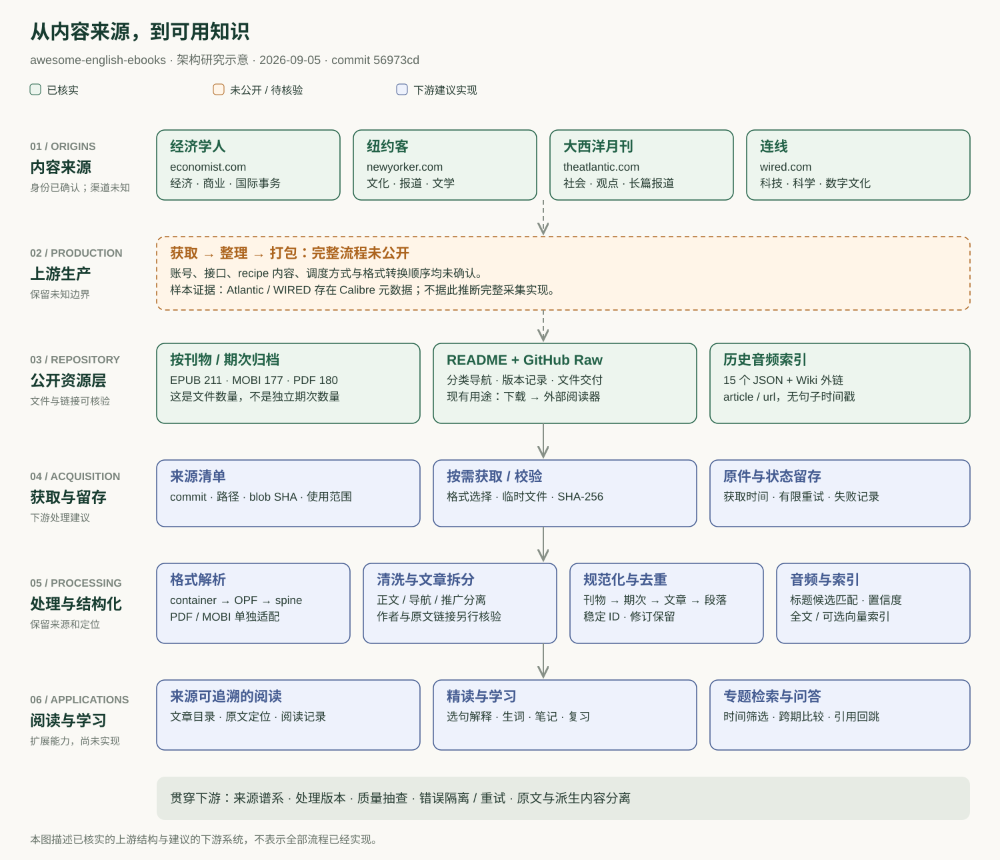
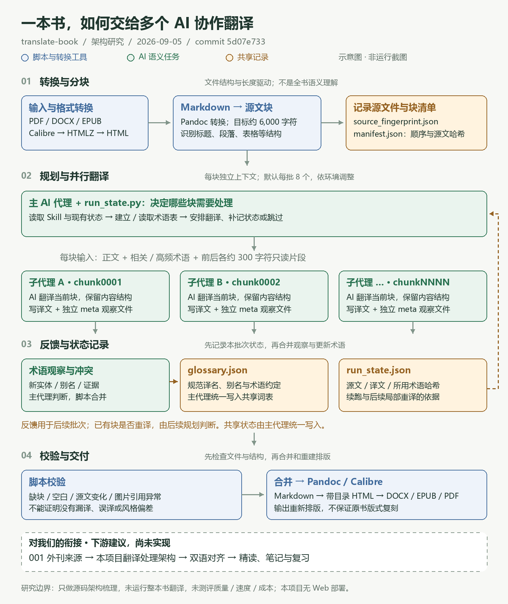

# GitHub 项目研究集

记录日常在 GitHub、X 等渠道发现的优秀开源项目：从理解设计、运行体验，到源码研究、实验复现与 Web 演示。

这里是研究总仓库。首页提供摘要、有序索引和项目预览；详细研究过程、代码与部署说明保存在各子项目中。

[在线研究导航](https://yydshly.github.io/0905_codex_project/) · [子项目目录](./projects/) · [新增与维护](./docs/project-guide.md) · [Web 部署约定](./docs/deployment.md)

阅读路线：[001 · 英语外刊来源与处理](./projects/001-awesome-english-ebooks/README.md) → [002 · 长内容并行翻译架构](./projects/002-translate-book/README.md)。从材料来源进入处理流程，各项目以架构图片引导阅读；002 仅提供 GitHub 文档与图片。

## 项目索引

按固定编号升序排列。编号从 `001` 开始，归档后保留，不随研究状态重新排序。

<!-- PROJECT_INDEX:START -->
当前收录 **3** 个研究项目。

| 编号 | 项目 | 研究摘要 | 主题 | 状态 | 上游 | 演示 |
| --- | --- | --- | --- | --- | --- | --- |
| 001 | [英语外刊资源库能力研究](./projects/001-awesome-english-ebooks/README.md) | 梳理当前与历史外刊来源、获取后的七步处理逻辑、EPUB 样本证据与完整架构 | 内容来源 / 文档处理 / 英语学习 | 已完成 | [源码](<https://github.com/hehonghui/awesome-english-ebooks>) | [在线体验](<https://yydshly.github.io/0905_codex_project/projects/001-awesome-english-ebooks/>) |
| 002 | [长内容并行翻译架构研究](./projects/002-translate-book/README.md) | 理解 AI 翻译与脚本编排的分工，梳理分块并行、术语反馈、断点续跑和局部重译架构 | Agent 架构 / 文档翻译 / 任务编排 | 已完成 | [源码](<https://github.com/deusyu/translate-book>) | — |
| 003 | [wibi-style 视觉风格工作流研究](./projects/003-wibi-style/README.md) | 汇集蜡笔、漫画、复古印刷、牛马宇宙等 28 款视觉风格，以图片或文字需求和风格规则驱动模型生成头像、海报与插画 | Agent Skill / 图像生成 / 视觉工作流 | 已完成 | [源码](<https://github.com/Vieeeeeee/wibi-style>) | [在线体验](<https://yydshly.github.io/0905_codex_project/projects/003-wibi-style/>) |
<!-- PROJECT_INDEX:END -->

## 项目预览

<!-- PROJECT_GALLERY:START -->
### 001 · 英语外刊资源库能力研究

[](./projects/001-awesome-english-ebooks/README.md)

梳理当前与历史外刊来源、获取后的七步处理逻辑、EPUB 样本证据与完整架构

[研究详情](./projects/001-awesome-english-ebooks/README.md) · [在线体验](<https://yydshly.github.io/0905_codex_project/projects/001-awesome-english-ebooks/>)

### 002 · 长内容并行翻译架构研究

[](./projects/002-translate-book/README.md)

理解 AI 翻译与脚本编排的分工，梳理分块并行、术语反馈、断点续跑和局部重译架构

[研究详情](./projects/002-translate-book/README.md)

### 003 · wibi-style 视觉风格工作流研究

[](./projects/003-wibi-style/README.md)

汇集蜡笔、漫画、复古印刷、牛马宇宙等 28 款视觉风格，以图片或文字需求和风格规则驱动模型生成头像、海报与插画

[研究详情](./projects/003-wibi-style/README.md) · [在线体验](<https://yydshly.github.io/0905_codex_project/projects/003-wibi-style/>)
<!-- PROJECT_GALLERY:END -->

## 仓库结构

```text
projects/                  按编号排列的独立研究子项目
  001-awesome-english-ebooks/  英语外刊资源库能力研究
    project.json          索引资料：名称、摘要、来源、状态、演示与封面
    README.md             研究介绍、结论、运行方式与图片说明
    assets/               封面、截图、流程图
    notes/                源码阅读、实验记录、研究结论
    web/                  可选 Web 演示；依赖与构建由子项目管理
docs/                     维护和部署约定
templates/project/        子项目文档模板
scripts/projects.mjs       新增项目、生成索引、校验资料
```

## 开始研究

需要 Node.js 22 或以上；仓库管理脚本没有第三方依赖，无需安装依赖。

```sh
node scripts/projects.mjs new --slug project-name --name "项目名称" --source "https://github.com/owner/repo" --summary "一句话说明项目价值与研究重点"
node scripts/projects.mjs sync
node scripts/projects.mjs check
```

将命令中的示例信息替换为实际项目。新增命令自动分配编号、创建文档并更新首页；后续修改子项目 `project.json` 后运行 `sync` 即可。详细说明见[新增与维护](./docs/project-guide.md)。

## 研究与来源

每个子项目记录上游仓库及研究版本，说明原项目能力、本仓库实验和实际验证结果。引用的代码、图片与其他素材保留来源和原许可证；具体许可信息随各子项目记录。
