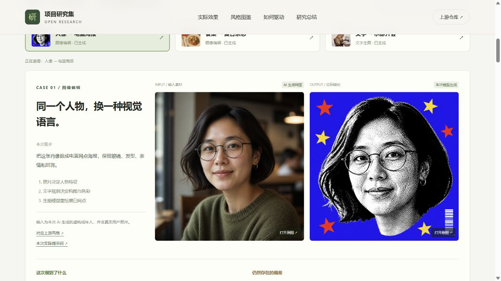
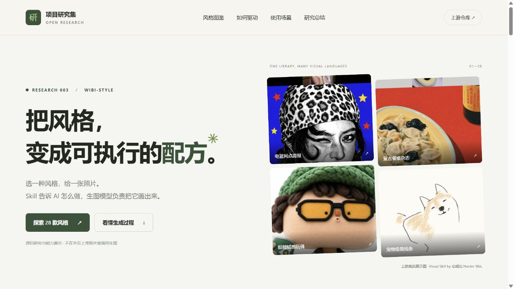

# 003 · wibi-style 视觉风格工作流研究

> 汇集蜡笔、漫画、复古印刷、牛马宇宙等 28 款视觉风格，以图片或文字需求和风格规则驱动模型生成头像、海报与插画。

[返回总索引](../../README.md#项目索引) · [上游项目](<https://github.com/Vieeeeeee/wibi-style>) · [研究笔记](./notes/README.md) · [Web 演示说明](./web/README.md)

## 这个库能做什么

**图片或文字输入 → 选择目标风格 → Agent 读取制作规则 → 图像模型生成 → 检查与交付。** wibi-style 将构图、配色、材质、内容保留和验收要求整理成独立 Skill；它提供创作配方，实际绘图依赖运行环境中的生图模型。

适合个人头像、宠物纪念图、旅行与家居记录、美食杂志风配图和文字创意海报。可以补充温暖、平静、荒诞等情绪需求，但不同风格适配程度不同，也不能保证一次完全符合要求。多数款以照片为输入，“牛马宇宙”等可使用文字创作。

## 28 款风格，一图看全

[](./assets/style-atlas-28.png)

点击打开原图。覆盖本轮研究固定版本全部 28 款，无省略、无重复；例如蜡笔手绘头像、牛马宇宙、电蓝网点海报、框景漫画、复古餐桌杂志、宠物极简线条等。图中素材为上游各款公开展示示例，并非同一原图的对照，也不代表我们已逐款生成验证。

原作者：**@威比 Hunter Wei.（抖音、小红书同名）**。来源：[wibi-style 固定版本](https://github.com/Vieeeeeee/wibi-style/tree/b51eff18eed78926e85f3e5602e1f79b220c7925)。本研究整理排版，保留署名与许可边界。[总览图来源与制作记录](./assets/README.md)

## 研究概览

| 项目 | 内容 |
| --- | --- |
| 研究目标 | 用真实风格图鉴和交互流程解释能力、驱动方式、使用场景与可扩展方向 |
| 上游版本 / commit | `b51eff18eed78926e85f3e5602e1f79b220c7925` |
| 研究日期 | 2026-09-05 |
| 技术栈 | 原生 HTML / CSS / JavaScript；Node.js 22+ 构建；无第三方构建依赖 |
| 上游许可证 | 自定义个人非商业许可；商业用途需作者事先书面许可，见[许可存档](./notes/upstream-LICENSE.txt) |

索引状态、主题标签和演示入口统一维护在 [`project.json`](./project.json)。

## 图片预览

**新增实际效果演示**：[本地查看三个场景](http://127.0.0.1:4178/projects/003-wibi-style/#generated-demo)。两组图像编辑对照和一张文字海报均为本次内置 image_gen 的实际输出。



| 场景 | 输入 | 实际结果 |
| --- | --- | --- |
| 人像 → 电蓝海报 | [AI 生成的虚构人物样图](./assets/generated/portrait-input-v1.png) | [1254×1254 PNG](./assets/generated/portrait-output-v1.png) |
| 餐桌 → 复古杂志 | [AI 生成的餐桌样图](./assets/generated/table-input-v1.png) | [1086×1448 PNG](./assets/generated/table-output-v1.png) |
| 文字 → 水豚开会 | 一只水豚在办公室开会，情绪稳定 | [1086×1448 PNG](./assets/generated/office-output-v1.png) |

实际文件保存在 `assets/generated/`。这是参考公开规则编写提示词的改编演示，未完整执行官方 Skill 或后处理脚本。[实验记录](./notes/generation-experiments.md) · [实际提示词](./notes/generation-prompts.md)

初版概览截图：



截图来自本项目实际运行的网页，右侧图片为上游公开风格展示，不是本研究生成结果。上游作者：@威比 Hunter Wei.（抖音、小红书同名）。[素材说明](./assets/README.md) · [手机截图](./assets/mobile.png)

## 值得研究的设计

- **Skill 是制作说明书，Agent 是执行者，生图模型实际绘制。** 作者提前整理风格规则，用户选择后，Agent 分析输入并组织本次生图指令。
- **28 款风格图鉴**：题材筛选、关键词搜索、详情与调用示例复制，每款提供固定版本来源。
- **3 个实际生成场景**：人像、餐桌、办公室海报，提供输入输出对照、原图下载与具体偏差说明；共 5 次调用，保留首轮结果。
- **3 条代表性流程**：电蓝网点的文字规则、框景漫画的局部选择与多步骤构图、复古餐桌的生图与脚本后处理，共 15 个可切换步骤。
- **场景与结论**：人像、生活记录、宠物、文字创作；包含扩展建议、对我们研究体系的意义与证据边界。
- **可复用的方法**：把经验写成输入条件、执行顺序、验收标准，再通过相同样本的对照实验验证效果。

## 本地运行

在仓库根目录运行：

```sh
node scripts/build-site.mjs
node scripts/check-site.mjs
node projects/003-wibi-style/web/preview.mjs
```

打开 [本地预览](http://127.0.0.1:4178/projects/003-wibi-style/)。端口冲突时设置 `WIBI_PREVIEW_PORT`。构建和发布细节见 [Web 说明](./web/README.md)。线上演示尚未验证，`demo` 保持空值。

## 实验与结论

本轮完成源码研究、交互网页和实际生图演示。网页验证包括桌面和手机布局、题材筛选、详情、三条流程与实际场景切换；构建同时检查五个生成文件的 SHA-256。

**已通过内置 image_gen 执行 5 次生成/编辑调用，得到 3 个场景的效果演示。** 两张输入样图为 AI 生成；两次编辑明确传入对应样图文件。未携带上游运行参考图、未执行完整官方 Skill 与后处理脚本；具体模型标识和计费信息未由工具返回。没有总体成功率、费用或跨模型一致性结论。

观察到人像网点偏细和白色边缘、餐桌细节重绘与红底颗粒、海报描边连带椅子等问题，网页保留这些偏差说明，不将它们宣称为严格验收通过。网页展示已生成的本地文件，不在浏览器中接受照片或实时生图。上游 28 款图鉴仍通过 GitHub Raw 载入，并与本次生成结果明确区分。

下一步建议选固定照片，对照普通提示词与完整 Skill，记录身份保留、构图遵循、风格一致性和重做次数。[详细研究](./notes/research.md) · [验证记录](./notes/verification.md)

## 参考与许可

- [上游固定版本](https://github.com/Vieeeeeee/wibi-style/tree/b51eff18eed78926e85f3e5602e1f79b220c7925)。作者：@威比 Hunter Wei.（抖音、小红书同名）。
- [原项目 LICENSE](https://github.com/Vieeeeeee/wibi-style/blob/b51eff18eed78926e85f3e5602e1f79b220c7925/LICENSE) · [本地许可存档](./notes/upstream-LICENSE.txt)。
- 本项目为独立研究展示，未复制完整 Skill、运行参考图或用户原片，不是上游官方发布。网页文字总结与交互独立实现；上游图片与规则的原权利边界不因研究引用改变。
