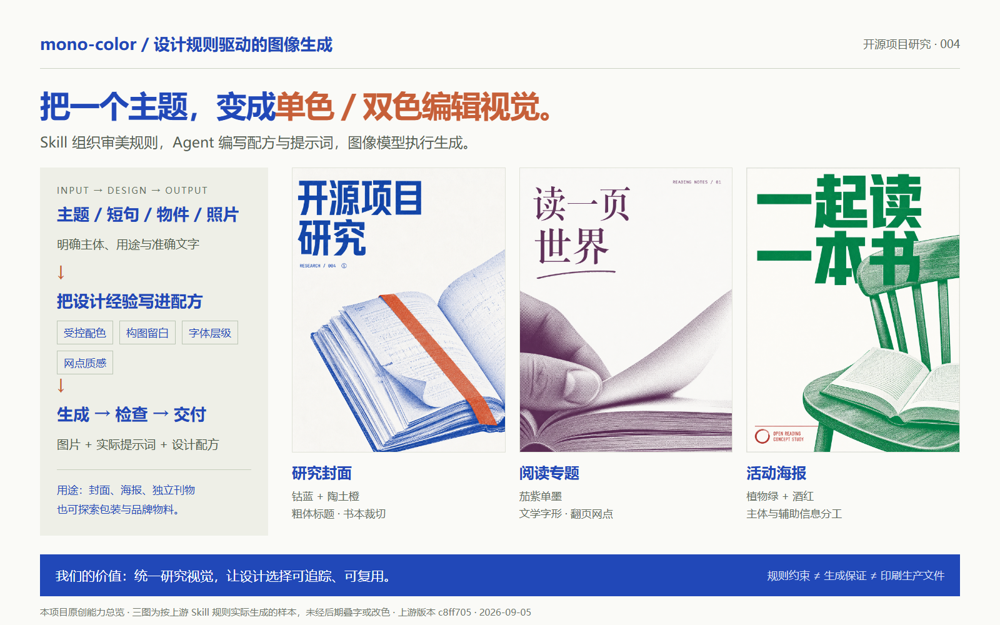
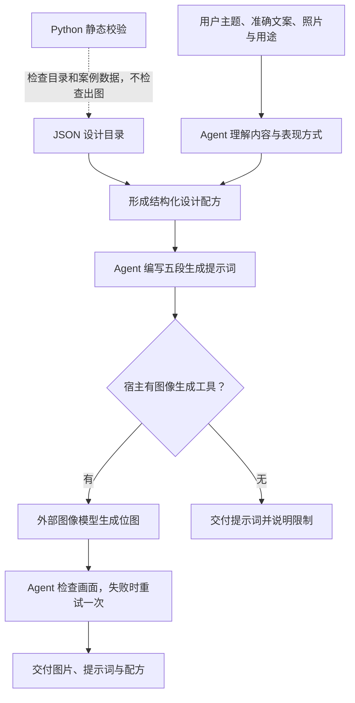

# 004 · mono-color 设计规则与图像生成工作流研究

> 把设计师对配色、构图、字体和印刷质感的判断整理成规则，由 AI 形成设计配方，再交给图像模型执行。

[返回总索引](../../README.md#项目索引) · [网页运行说明](./web/README.md) · [使用指南](./notes/usage.md) · [源码与验证记录](./notes/README.md) · [扩展与实验计划](./notes/extensions.md) · [上游仓库](https://github.com/yanliudesign/mono-color-skill)



上图将设计流程与本次三张实际生成结果放在一起；这是本项目原创说明图，不是上游作者示例。

## 研究结论

mono-color 的核心资产是一套可复用的设计规范与提示词工作流。它将主题、短句、物件或照片转成单色 / 受控双色编辑视觉，适合海报、专题封面、独立刊物和观察笔记等文字较少、主题明确的作品。

它对 AI 的控制主要来自规则、结构化配方和生成后的检查。仓库没有提供通用的图像生成服务或完整的程序化排版引擎；配色、布局等约束仍依赖模型理解和执行。印刷质感的位图也不等于可直接交付印厂的分色文件。

本轮完成源码研究、静态校验与交互研究网页，并由 Agent 读取上游 Skill 和设计目录、通过内置 image_gen 实际生成三张图片。**已验证三个样本的视觉效果；未开展中文准确率对照实验、照片保真或印刷验证**。项目状态“已完成”指当前研究与本地网页完成，不代表扩展建议已全部实现。

## 从用户想法到成果

用户可以从“我想推出一个产品、制作社群周边、办活动、出版刊物”出发，利用 mono-color 得到产品效果图、包装视觉、活动主视觉或刊物素材等可评审方案。它负责视觉设计与生成环节；可发布排版、生产文件、打样和实际商品仍需其他工具与专业流程。

完整路径见[需求到最终成果](./notes/user-goals.md)，下一层的输入、输出与试用请求见[具体使用场景](./notes/use-cases.md)。页面配有相关作者案例，明确区分实际样本和待验证方向。

## 交互研究网页

网页提供五个能力维度的切换说明、五步生成流程、研究封面 / 阅读专题 / 分享活动三个场景、三张实际生成图片的画廊、原图放大与下载，以及实际提示词的复制和下载。扩展区域按“如何实现 / 如何验收”展开。

本轮已按上游 Skill 与设计目录，通过内置 image_gen 实际生成三张图；图片没有后期叠字或改色。网页展示已生成结果，不实时调用模型。原始提示词、配方及偏差见 [出图记录](./assets/generated/REVIEW.md)。本地构建、预览和验证方法见[网页说明](./web/README.md)。

## 研究版本

| 项目 | 记录 |
| --- | --- |
| 上游 | `yanliudesign/mono-color-skill` |
| 固定 commit | [`c8ff70597ddedcd65f21a0b528f6a70c35690b0a`](https://github.com/yanliudesign/mono-color-skill/tree/c8ff70597ddedcd65f21a0b528f6a70c35690b0a) |
| 提交时间 | 2026-09-02T11:49:40-07:00 |
| 研究日期 | 2026-09-05 |
| 实现组成 | Markdown 工作流、JSON 设计目录与评估案例、Python 校验和示例绘制脚本 |
| 本地环境 | Windows / PowerShell、Node.js 22.15.0、Python 3.10.11 |
| 软件许可 | MIT；示例图与第三方参考图另有许可边界 |
| 本轮验证 | 16 个案例的数据检查通过；六份设计目录及相关资源检查通过 |

## 已有能力与验证边界

“规范支持”表示上游明确给出了工作流，并不代表本仓库已经验证生成质量。下表证据均对应固定版本，详细链接见[源码记录](./notes/README.md#证据索引)。

| 能力 | 已有实现 | 本轮确认的边界 |
| --- | --- | --- |
| 输入理解 | 从主题、短句、物件、文章想法或照片识别主体、意图、文字、图像角色和表现方式 | 由语言模型理解；无独立输入解析器 |
| 配色 | 三种纸色、单墨与双色模式、墨色分工和面积比例规则 | 已观察三张样本；比例与留白未量测，不保证严格符合 |
| 构图 | 九类布局，按内容条件选择，而非完全随机选模板 | 是决策说明与几何范围；无通用布局求解器 |
| 字体 | 七种字体角色，区分展示文字、辅助信息与可选手写插话 | 不保证具体字体文件、字形或中文渲染准确 |
| 照片改编 | 忠实再现，或抽取 2–4 个身份锚点进行抽象表达 | 保留身份是约束目标，尚无保真评测结果 |
| 印刷外观 | 网点、孔版、蓝晒感、复印质感、套印偏移等描述 | 主流程依赖图像模型模拟，无通用物理印刷仿真 |
| 视觉节奏 | 一个强焦点与一个安静区域，允许局部大胆裁切或超大文字 | 用可观察规则解释“松弛感”，仍需视觉判断 |
| 交付 | 图片、实际生成提示词和配方摘要；缺少出图能力时退化为提示词 | 不自带通用模型 API 调用器 |
| 质量处理 | 全尺寸与缩略图检查；不合格时重试一次，文字仍出错时建议外部排版 | 属于 Agent 执行规范，非自动视觉测试程序 |
| 工程辅助 | JSON / 资源验证、设计板与一个特定海报的绘制脚本 | 有真实可执行代码，但示例脚本不等于通用海报产品 |

### 配色和风格的两个容易误读之处

- 名称含 mono-color，但当前默认是受控双色，兜底配方为钴蓝 + 陶土橙；明确请求单色时才使用单墨。
- 当前默认是当代编辑设计。限制色彩、加入网点并不自动意味着泛黄纸张或复古做旧。

双色规则为主墨承担约 70%–85%、辅墨约 15%–30% 的印刷面积；纸色不算墨色，叠印产生的混合外观也不直接算第三块色版。不能用 RGB 像素的不同颜色数量来判断是否超过两种墨。

机器目录实际包含 **19 个墨色、10 个配方、7 种字体角色、9 类构图、7 类载体、5 类印刷瑕疵、3 类节奏配置**。文档列出的颜色组合多于机器配方目录，二者尚未完全对齐，详见[一致性问题](./notes/README.md#发现的一致性问题)。

## 底层工作机制

以下为本仓库根据源码绘制的流程示意，非运行截图或已执行记录。



1. **理解输入。** 分清主体是什么、要表达什么、哪些文字必须准确，以及照片需要忠实再现还是抽象提炼。
2. **形成配方。** 固定比例、纸色、墨色、色版职责、构图、字体、焦点、安静区域与质感处理等字段。
3. **按内容路由。** 活动信息优先信息海报，植物标本选择档案图版，明确重复物件选择物件场；用户明确选择可覆盖默认规则。
4. **编写提示词。** 按画布与墨色、构图、主体、字体文字、材质与排除项五段组织。
5. **生成与检查。** 外部模型出图，Agent 根据墨色、可读性、主体身份和构图等条件检查。

这里的“Prompt Compiler”主要是让语言模型遵循的编写流程，并不是已有的通用编译器程序。稳定配方和稳定种子的要求也不等于相同输入必定得到同一张图片。

它最值得借鉴的方法，是将“有松弛感”“有印刷感”等抽象要求，转译成主体裁切、焦点、留白、色版职责和有限瑕疵等可以讨论和检查的设计决策。

## 使用场景

| 场景 | 输入重点 | 可以利用的能力 | 交付前需要补的环节 |
| --- | --- | --- | --- |
| 研究文章、播客与专题封面 | 主题、短标题、比例 | 视觉隐喻、有限配色、强焦点 | 核对文字与主题表达 |
| 书店、展览、读书会海报 | 准确标题、日期和地点 | 主次信息层级与编辑网格 | 准确文字叠加和事实核验 |
| 人像、旅行照片改编 | 有权使用的照片与保留要求 | 网点、裁切、抽象锚点 | 人物身份和场景保真检查 |
| 独立刊物、章节页、观察日志 | 短文本和主图 | 纸面、印版与字体角色 | 长文另用排版工具处理 |
| 系列卡片、邀请函、明信片 | 共同主题、共享配色与版式 | 配方复用与风格延续 | 批量一致性和多尺寸适配 |
| 包装、服装周边概念 | 产品信息与载体要求 | 载体视觉语言与风格探索 | 刀模、真实尺寸、色版、工艺另行制作 |

上游载体目录含包装与服装等用途，但其通用画布规则又强调正面平面画布、排除样机。现阶段应明确自己要的是平面印刷图还是载体概念图，不能认为载体规则已经形成完整生产流程。

大量正文、精确技术关系图、完整网页 UI、真实包装结构设计和印前分色不属于已验证能力。技术研究的封面可以用视觉隐喻，架构图仍应以准确的节点和关系为主。

## 如何使用

完整步骤见[使用指南](./notes/usage.md)，包括上游安装方式、环境条件、四种请求示例、结果检查与本地校验命令。

一次有效请求至少说明：**用途、主题、准确文字、单色或双色、画幅、照片保留要求、交付形式**。例如下面是本仓库编写的待试用请求，尚未执行：

```text
用 mono-color 为“长内容并行翻译”做一张 3:4 研究封面。
准确标题为“长内容并行翻译”，不得翻译或改写。
使用钴蓝和陶土橙，采用当代编辑风格。
用一组分开的纸页汇入一本书表达主题，不添加无法验证的技术标签。
输出图片、实际生成提示词和配方。
如果中文仍不能准确呈现，交付少文字底图并说明需要另行排版。
```

原版默认自行创作英文短文案；中文使用者应明确给出准确标题。更可靠的生产方向是让模型生成主体与质感，再由程序准确叠加中文，但这属于我们建议的扩展。

## 对本仓库的意义与扩展方向

- **呈现层：** 为研究项目建立统一封面语言，保留不同主题的区别。实际截图继续展示真实运行结果。
- **流程层：** 把“研究结论 → 视觉主题 → 设计配方 → 图片 → 核验”变成可追踪过程。
- **研究层：** 与现有视觉 Skill 研究形成互补，比较风格如何表达、规则如何组织、质量如何验证；不预设其他项目已经具备相同机制。

优先扩展真实配方编译、中文独立排版、规则一致性和端到端出图评测；之后再考虑系列管理、多尺寸适配与印刷输出。每项新增能力、验收方式和实验条件见[扩展计划](./notes/extensions.md)。

## 验证与许可

本轮已运行上游 `validate_evals.py` 与 `validate_design_system.py`，通过只证明数据和指定资源满足检查，不能推出图片美观、中文准确、身份保真或重试稳定。执行记录、源码对应及未验证范围见[研究笔记](./notes/README.md)。

本子项目新增研究文档、原创网页代码、能力总览图和三张实际生成样本，不复制上游实现或示例图片。软件采用 [MIT](https://github.com/yanliudesign/mono-color-skill/blob/c8ff70597ddedcd65f21a0b528f6a70c35690b0a/LICENSE)，作者示例与第三方参考图遵循独立的[素材许可](https://github.com/yanliudesign/mono-color-skill/blob/c8ff70597ddedcd65f21a0b528f6a70c35690b0a/ASSET-LICENSE.md)。网页从原站加载作者精选示例，保留[上游浏览入口](https://github.com/yanliudesign/mono-color-skill/blob/c8ff70597ddedcd65f21a0b528f6a70c35690b0a/README.zh.md)。

已提供本地交互网页与代表性能力总览封面。公网地址在部署验证通过后填写；封面由 project.json 管理，总索引由脚本同步。


## 作者精选输出

网页补充作者精选的 12 张生成案例，包含海报、观察与刊物、包装、品牌周边。图片由浏览器从固定上游版本直接加载，不随项目分发。每张提供中文设计解读、可借鉴的应用方向与原作链接；设计解读为本项目观察，不是作者原始提示词。
