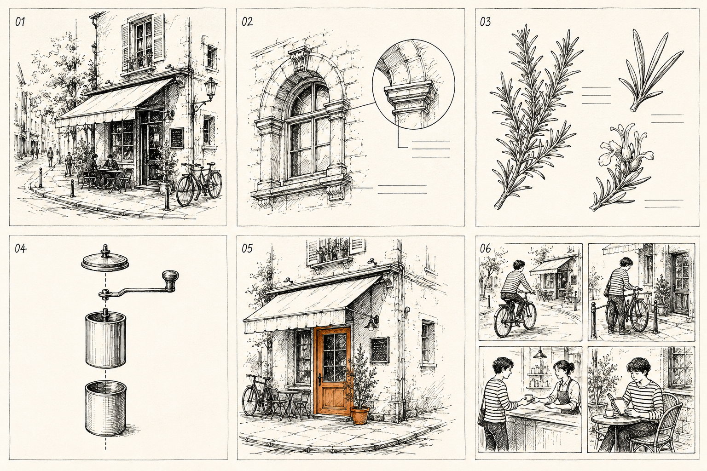
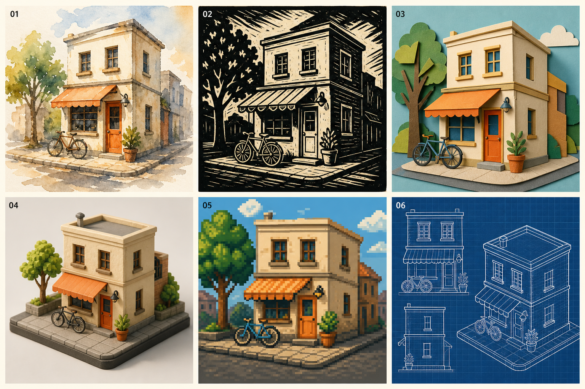
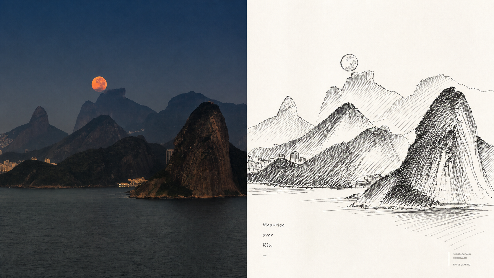

# 005 · XXD Panel 092 线描创作工作流研究

通过中文研究网页理解照片线描转译，并用交互配置器把模式、画幅、文字和批量规模转成可交给 Agent 执行的任务。

[返回总索引](../../README.md) · [上游仓库](https://github.com/nevertoday/xxd-panel-092) · [研究记录](./notes/README.md) · [网页运行说明](./web/README.md)

## 研究总结

XXD Panel 092 的核心是“照片 → 表现性钢笔线描”，可输出原图对照或独立设计。仓库提供风格原文、Agent 执行规范与辅助脚本，图像理解和绘制依赖外部模型；价值主要在创作约束和交付流程，而非新的图像算法。

仅增加画风，应用价值有限。本次从两条路线展示扩展：保留钢笔表现，加入观察细节、部件关系和连续叙事；或沿用工作流组织方式，另建水彩、木刻、纸艺、微缩、像素与蓝图风模块。两张实际生成图鉴共展示十二种创意，每种配场景和交付边界。

对我们的意义是积累可复用的视觉任务规范。优先尝试城市速写、局部点色与个人内容配图；结构说明、植物观察和多格故事必须增加事实依据或一致性验收。网页提供配置、提示词和评测入口，不把概念出图等同于生产能力。

## 本轮成果

- 真实上游样张与四种交付模式说明。
- 可点击的四步工作流，区分 Agent、风格提示词、图像模型与辅助脚本。
- 新增任务配置器：多模式、多画幅、目录规模估计、三种文字方式、四端壁纸。
- 自动生成自然语言任务指令、Skill 参数示例与可下载任务单；提供 CSV 评测模板。
- 安装与首次使用路线、工程扩展建议、源码限制与来源索引。
- 六种钢笔线描扩展创意，包含本次实际生成的效果图、对应场景与逐项可复制创作要求。

## 钢笔线条还能怎样用



这张图于 2026-09-05 使用内置 ImageGen 和[独立扩展提示词](./notes/creative-atlas-prompt.txt)生成，无参考照片，实际输出 1536×1024。它是创意效果演示，不是上游 Skill 实测结果，也不是原照片转换对照。

| 图号 / 创意 | 对应使用场景 | 比单幅线描多了什么 | 与上游关系 |
| --- | --- | --- | --- |
| 01 城市速写明信片 | 游记、城市漫步、个人纪念卡 | 地点概括与手写留白 | 原有风格可尝试 |
| 02 建筑细节注释 | 建筑参观、设计学习笔记 | 主体与局部放大的对应关系 | 需新增布局规范与事实复核 |
| 03 植物观察手账 | 园艺记录、亲子写生 | 主枝、叶片、花朵的分层观察 | 需多参考图和观察页布局 |
| 04 物件拆解说明 | DIY、简单器物清洁记录 | 部件顺序与对应关系 | 需真实部件及结构依据 |
| 05 局部彩色强调 | 游记封面、个人邀请、系列配图 | 指定一个视觉重点 | 需用户明确颜色覆盖 |
| 06 连续四格故事 | 生活日记、旅行小故事 | 动作顺序与人物连续性 | 需新增脚本与多格一致性规范 |

图中的建筑构造、植物和磨豆器是概念表达，未经科学或机械验证；实际说明不得从外观照臆测内部结构。故事四格展示了骑车、停车、买咖啡、阅读的顺序，精确人物连续性仍需复核。

最容易落地的是 01 与 05。02–04、06 增加了信息表达方式，不能仅凭现有四种输出模式宣称上游已经支持。网页“创意图鉴”可点击图片中的编号，逐项查看示例任务并复制创作要求。

我们的判断：只需偶尔生成漂亮线描时，一条风格提示词可能足够；需要反复制作观察页、说明页或故事页时，才值得扩成独立流程。

## 跳出钢笔：同一思路的六种视觉创意



使用内置 ImageGen 和[独立提示词](./notes/medium-atlas-prompt.txt)实际生成，没有参考照片；同一建筑意象的六种表现，细节不保证严格一致。

| 创意 | 使用场景 | 交付注意点 |
| --- | --- | --- |
| 水彩旅行卡 | 游记、纪念明信片 | 准确日期和地名后期排版 |
| 木刻版画海报 | 艺术海报、刊物封面 | 关注缩小后的轮廓与黑白可读性 |
| 层叠纸艺邀请 | 生日邀请、节日贺卡 | 预留准确文案位置 |
| 等距微缩场景 | 虚构街区导览、场景概念 | 位图不等于可编辑 3D 模型；真实布局需核对 |
| 像素游戏场景 | 个人游戏原型、场景设定 | 还需网格、图层、碰撞等工程处理 |
| 蓝图风观察页 | 设计笔记、概念展示 | 不具备测绘或施工准确性 |

这六项是另建风格模块的创意，不是 092 内置能力。可以复用组织工作流的思路，但需要独立审美规则、交付规范和验证方式。网页把“钢笔内部扩展”和“更换视觉表达”分开展示。

本页面不会上传图片、调用图像 API 或安装 Skill。它整理执行要求，生成操作任务；真正出图仍在支持参考图生成的 Agent 中完成。

## 研究版本与边界

| 项目 | 记录 |
| --- | --- |
| 上游提交 | `9e86434703fe8eeccac2b6055900716c8eda4ee6` |
| 研究日期 | 2026-09-05 |
| 本页技术栈 | HTML / CSS / JavaScript，Node.js 22+，无第三方依赖 |
| 上游许可 | PolyForm Noncommercial License 1.0.0；[原许可](./assets/UPSTREAM-LICENSE.txt) |
| 已核读 | 原始提示词、SKILL 工作流、三个 Python 脚本、样张来源说明 |
| 实测范围 | 本页任务逻辑、构建、资源链接和浏览器交互；详见研究记录 |
| 未验证 | 上游 Skill 安装与实际出图、中文准确率、批量运行成本与跨模型稳定性；本次独立 ImageGen 概念图已生成并检查 |

## 样张



上图为上游 sample-05，不是本地运行结果。对照中的照片区域也由模型构成，不能证明原图像素保真。图片、风格原文的来源与许可见 [SOURCES.md](./assets/SOURCES.md)。

## 我们该怎样用

1. 在支持 Skill 的 Agent 环境按上游文档安装本项目。
2. 准备有使用权、轮廓清楚的单张照片，确认参考图生成工具实际可用。
3. 在网页选择“初次体验”，填写素材路径，将生成的任务指令复制给 Agent。
4. 先验收无字对照结果，再增加中文、多画幅或目录批量。
5. 使用评测表记录主体、风格、文字、裁切、耗时与重试；只重做失败项。

商业复用须先解决授权，不能将上游按宽松商业许可处理。扩展研究应保留原项目来源与许可，并明确哪些实现由本项目新增。

## 本地构建与预览

在研究总仓库根目录运行：

```sh
node --test projects/005-xxd-panel-092/web/task.test.mjs
node scripts/projects.mjs check
node scripts/build-site.mjs
node scripts/check-site.mjs
node projects/005-xxd-panel-092/web/preview.mjs
```

预览地址：`http://127.0.0.1:4185/projects/005-xxd-panel-092/`。

网页已于 2026-09-05 完成 GitHub Pages 发布验证：[在线研究网页](https://yydshly.github.io/0905_codex_project/projects/005-xxd-panel-092/)。入口、CSS、JavaScript 模块、两组创意图与许可资源均返回 HTTP 200。
