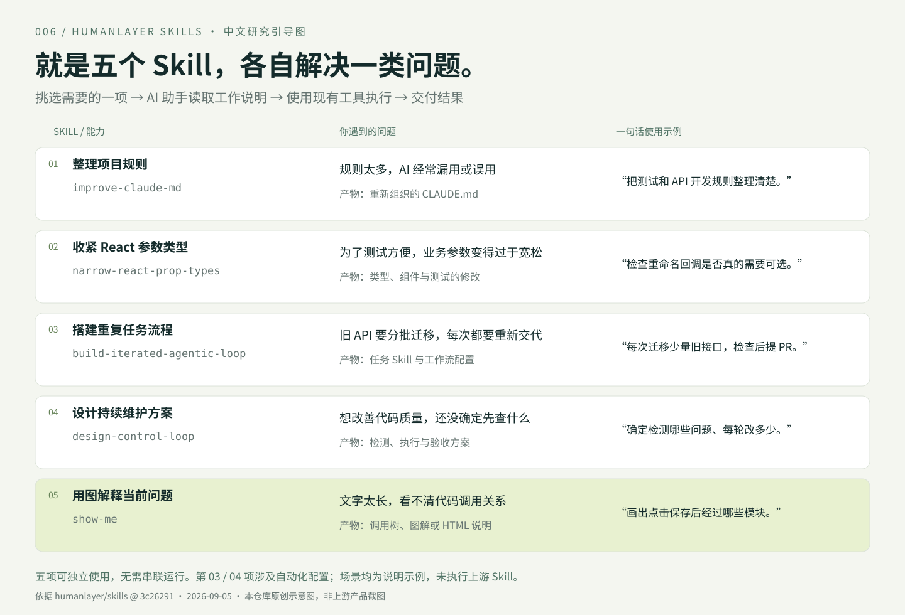

# 006 · HumanLayer Skills：五个 Skill 与使用场景

**这个库收录了五个可以单独使用的 Skill，分别处理五类任务。** 每个 Skill 主要是一份给 AI 编程助手读取的操作说明；复杂的任务还附有模板和辅助脚本。使用时挑选对应的一项，不需要把五项串起来运行。

[返回总索引](../../README.md) · [上游仓库](https://github.com/humanlayer/skills) · [源码与验证记录](./notes/README.md) · [在线能力展示](https://yydshly.github.io/0905_codex_project/projects/006-humanlayer-skills/) · [本地展示页说明](./web/README.md)



*本仓库原创能力引导图，依据固定版本源码整理；不是上游产品截图。*

## 五个 Skill，分别解决什么问题？

| Skill | 实际能力 | 什么时候用 | 最终得到什么 |
| --- | --- | --- | --- |
| **improve-claude-md** | 整理 CLAUDE.md，精简重复内容，标明规则的适用条件 | 项目规则很多，AI 经常漏用或误用 | 重新组织的规则文件 |
| **narrow-react-prop-types** | 根据生产调用收紧 React Props，调整相关组件和测试 | 为了测试或演示方便，把业务参数定义得过于宽松 | 类型和代码修改，以及验证结果 |
| **build-iterated-agentic-loop** | 为已明确的重复任务建立 Skill、工作流、提示词和记忆 | 同一类维护工作需要反复交代，如分批迁移旧 API | 定制后的自动化配置与辅助文件 |
| **design-control-loop** | 帮你明确改善目标、检测方式、每轮任务与验收，再搭建流程 | 想改善代码质量，但还没确定从哪里开始 | 可执行的维护方案与对应组件 |
| **show-me** | 用图、调用树、diff 或 HTML 解释当前问题 | 文字说明太长，看不清调用关系或变化 | 图解或可视化说明 |

第三项用于“已经知道要做什么，建立重复执行流程”；第四项用于“先确定具体改善什么、如何检测与验收”。持续改进闭环主要属于这两项，不是整个库的统一运行方式。

## 五个简单使用场景

下面是给助手的示例请求及预期产物，属于说明性示例，未执行上游 Skill。

1. **整理规则**：用 improve-claude-md，“把测试、API 开发等规则按适用任务整理清楚。” → 基础背景保留，测试规则放在明确的测试条件下。规则是否更容易被遵守仍需实测。
2. **整理组件参数**：用 narrow-react-prop-types，“检查重命名按钮是否真的需要可选回调。” → 查生产调用，证据支持时将回调改为必填，修改辅助代码并运行检查。
3. **重复维护**：用 build-iterated-agentic-loop，“每次迁移少量旧 API，测试通过后提 PR 给我审阅。” → 创建任务 Skill 与运行配置；配置、凭据及验证就绪后，由外部编码 Agent 执行。
4. **设计维护方案**：用 design-control-loop，“帮我把代码质量改善拆成可测量、可验收的小任务。” → 例如确定检测哪类问题，每轮处理多少，以及通过什么检查才算完成。
5. **理解代码**：用 show-me，“画出点击保存后，数据经过哪些模块。” → 得到“保存按钮 → 校验输入 → 调用接口 → 更新界面”的示意；真实调用关系必须从项目代码核实。

## 一个具体前后对比：重命名按钮

假设真实业务调用都提供重命名回调，但为了让 Storybook 少写参数，类型被改成了可选：

```tsx
// 修改前：允许“按钮可见，却没有动作”的状态
type Props = { onRename?: () => void };
<button onClick={() => onRename?.()}>重命名</button>
```

narrow-react-prop-types 指导助手查生产调用、确认真实契约。证据支持后，可能改为：

```tsx
// 修改后：调用方遗漏回调时，类型检查会报错
type Props = { onRename: () => void };
<button onClick={onRename}>重命名</button>
```

接着补齐 Storybook 和测试中的回调，检查组件及消费它的应用。**不是遇到问号就删除**：业务确实允许缺省时应保留；公开组件库还要考虑仓库外部使用者。

## 怎么理解它的原理？

`你的任务 → 选择一个 Skill → 助手读取说明 → 使用现有工具执行 → 交付结果`

Skill 固化做事步骤和判断标准，实际能力来自宿主 AI 助手及其工具。工作流类 Skill 另附 CI 模板和反馈脚本；记忆是下次读取的 Markdown 规则，不会更新模型参数。条件标签只是提示结构，不提供程序级强制执行。

## 对我们的意义

现在最直接可用的是 show-me：把开源项目的逻辑讲清楚。研究项目多了以后，可以借第三、第四项定制“每次复核一个项目的过期研究资料”。后者是我们的扩展方向，上游没有现成的研究库维护 Skill。

## 版本、验证与许可

- 研究日期：2026-09-05；上游固定提交：[`3c26291`](https://github.com/humanlayer/skills/tree/3c2629142c5d437428269b1b722b08c0b87f574d)。
- 上游采用 MIT，保留[许可原文](./notes/upstream-LICENSE.txt)；本地网页与引导图为原创讲解。
- 已阅读五项 Skill 和相关模板；本地展示采用原生 HTML/CSS/JS，Node.js 22+，无第三方依赖。
- 网页能力面板与场景说明可交互；进阶闭环实验是预设数据模拟，不调用模型、不修改仓库、不创建 PR。
- 未验证上游 Agent / CI 实跑或效果提升；运行与检查方式见 [Web 说明](./web/README.md)。
