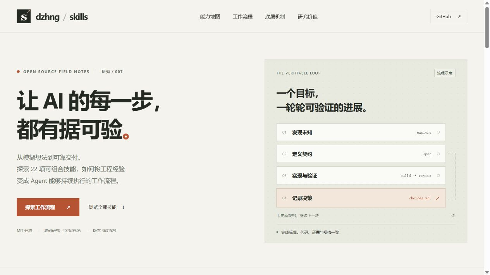
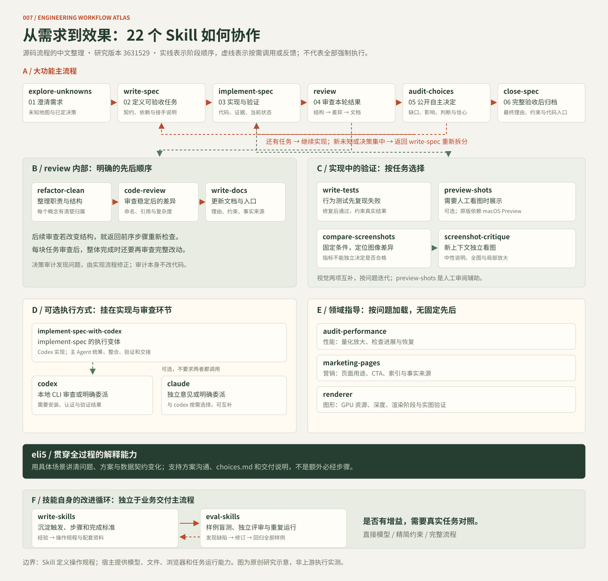
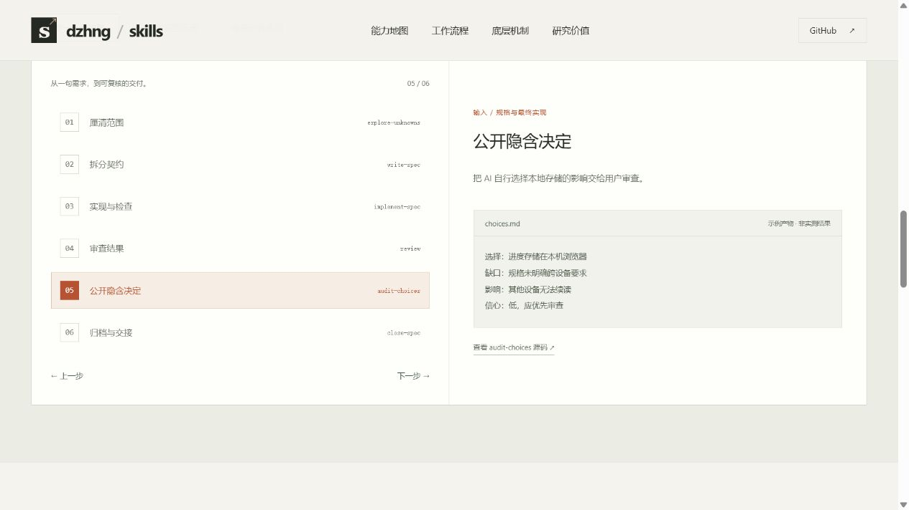

# 007 · dzhng/skills 可验证工程工作流研究

通过 22 项技能地图、三种任务流程和决策审计示例，理解如何将 AI 工程经验组织为可复用、可交接、可验证的操作规程。

[返回总索引](../../README.md#项目索引) · [上游项目](https://github.com/dzhng/skills) · [研究笔记](./notes/README.md) · [网页运行说明](./web/README.md)



本图为本仓库原创研究网页的运行截图，右侧为流程示意，不是上游产品界面。

## 完整能力与使用顺序



本图为原创研究示意，整理固定版本源码中的调用关系。主流程按任务裁剪，领域技能与模型 CLI 按需调用；不表示 22 项必须依次执行。

[逐项阅读全部 22 个 Skill：能力、案例、场景、产物、顺序与限制](./notes/skills-guide.md)

网页能力卡片同样提供完整说明，并新增可缩放总览图和价值判断。文档与网页共用数据源，由 `web/generate-research.mjs` 生成详细指南和 SVG。

## 模型增强后的价值判断

我们认为，模型已能稳定完成的通用建议应当精简；项目事实、验收标准、工具证据和交接记录仍值得保留。多 Agent、多轮规划及固定审查会增加成本，作者的架构偏好也未必适合所有产品。

建议比较“直接模型、精简约束、完整 Skill 流程”在相同任务上的成功率、漏项、返工、人工纠正次数、耗时与成本。尚未进行对照实验，以上是研究判断，不是已证实收益。

## 研究范围

| 项目 | 内容 |
| --- | --- |
| 研究目标 | 能力、底层机制、使用场景、扩展方向和对本仓库的意义 |
| 上游版本 | `3631529b7305eec8dd08b3a827f4d8c16342a29a`，提交时间 2026-08-25 |
| 研究日期 | 2026-09-05 |
| 技能数量 | 22：工程 16、视觉 3、技能编写与评测 2、图形 1 |
| 网页技术栈 | 原生 HTML / CSS / JavaScript，Node.js 22+ 构建，无第三方依赖 |
| 上游许可证 | [MIT](https://github.com/dzhng/skills/blob/3631529b7305eec8dd08b3a827f4d8c16342a29a/LICENSE) |
| 验证范围 | 源码研究、原创网页构建与浏览器交互；未复现完整自主开发流程 |
| 发布状态 | 已接入静态站点构建；尚未部署验证，demo 留空 |

## 网页内容

- **能力地图**：按四类筛选、搜索 22 个技能；每项给出场景、产物、限制和固定版本源码链接。
- **流程演示**：阅读器开发、单双色页面改进、已有改动审查；可选择阶段并查看示例产物。
- **底层机制**：行为规程、文件状态、宿主工具三层分工。
- **决策审计**：用阅读进度存储示例解释“能运行”背后的产品取舍。
- **研究应用**：映射到 001—004 的内容处理、翻译和视觉研究，提出领域评测、CI 与 Windows 适配建议。
- **来源记录**：技能链接锁定研究 commit；教学示例与实测结果明确区分。



## 主要结论

库的主体是操作规程。它通过可独立验证的任务切分、持续更新的规格与接手说明、审查和决策记录，约束 Agent 的工作过程。实际模型调用、文件操作、测试与浏览器由宿主提供。

截图比较提供差异定位工具，不提供通用审美评分。单双色设计的低颜色数量、大面积留白应按设计目标判断。

最适合本仓库优先试用的三项是任务契约、决策记录和证据验收；是否减少返工，需要真实任务对照评测。页面中的应用建议尚未集成到其他子项目。

## 本地运行

在仓库根目录执行：

```sh
node projects/007-dzhng-skills/web/build.mjs
node projects/007-dzhng-skills/web/serve.mjs
```

打开 [本地预览](http://127.0.0.1:4177/0905_codex_project/projects/007-dzhng-skills/)。服务运行时可用。可通过 PORT 环境变量修改端口。

全站检查：

```sh
node scripts/projects.mjs check
node scripts/build-site.mjs
node scripts/check-site.mjs
```

## 来源与许可

研究依据为 [固定版本源码](https://github.com/dzhng/skills/tree/3631529b7305eec8dd08b3a827f4d8c16342a29a)。技能说明为中文概括，流程案例、网页代码与截图为本仓库原创；没有复制上游执行脚本、品牌图片或完整 Skill 文件。上游采用 MIT 许可，后续引入其实现时应附原始许可文件。

验证过程与限制见[研究笔记](./notes/README.md)，图片来源见[素材说明](./assets/README.md)。
