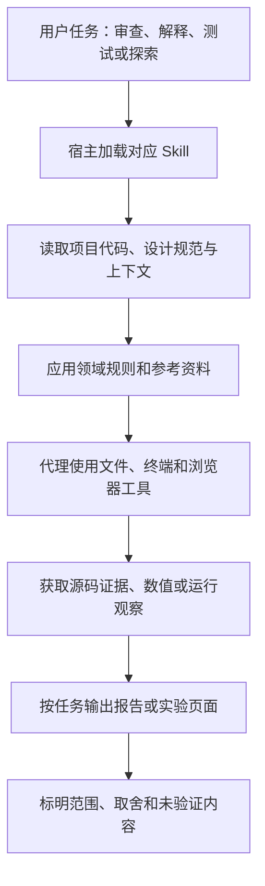

# 009 · 界面设计与审查 Skills 工作流研究

> 研究价值：通过源码与真实页面实验，认识通用界面 Skill 的收益边界；借鉴其组织方法，沉淀我们自己的网页优化规则与验收能力。

[在线能力图谱](https://yydshly.github.io/0905_codex_project/projects/009-jakubkrehel-skills/) · [真实前后对比](https://yydshly.github.io/0905_codex_project/projects/009-jakubkrehel-skills/run.html#visible-difference) · [返回总索引](../../README.md#项目索引) · [上游仓库](https://github.com/jakubkrehel/skills) · [源码阅读](./notes/01-source-reading.md) · [验证与实验计划](./notes/02-validation-and-experiments.md)

## 研究结论

这个库把设计工程师的经验整理成 **11 个 Agent Skill**，覆盖界面细节、排版、颜色、无障碍、布局、产品文案、综合审查、变更审查、网页机制解释、组件边界检查和方案探索。

核心实现是 Markdown 规则、工作步骤、参考资料与宿主适配配置。实际读取代码、计算颜色、修改组件和操作浏览器的工作由宿主 AI 代理及其工具完成。它提供专业判断依据与执行流程，本身没有独立模型、浏览器引擎或完整自动测试平台。

**本轮结论：保留为参考资料，按需借鉴，不作为默认加载或重点集成的能力库。** 实际修复主要涉及字号、选中提示、搜索标签和空结果恢复，整体视觉变化有限。用户观察也未感受到明显的整体改善；这是一条定性反馈，不是用户研究或统计结论。

这些问题可能由模型直接发现和修复。本轮没有“相同模型、相同任务、有无 Skill”的对照，不能把改进归因于这个库，也不能由单个案例推断它普遍无效。随着模型能力提升，通用知识的增量价值可能下降，这是我们的工作假设，并非本轮验证过的模型能力结论。

**值得吸收的是方法：把项目经验写成明确的任务约束，用真实页面和验证结果检查模型的实现。** 不止要求“更好看”，而是明确用户任务、必须保留的行为、需要解决的问题、适用场景和验收方式；反复有效的经验再沉淀为自有规则。详见[最终理解与自有能力沉淀方案](./notes/04-conclusions-and-own-capability.md)。

## 研究范围与版本

| 项目 | 记录 |
| --- | --- |
| 研究日期 | 2026-09-05 至 2026-09-06 |
| 上游版本 | [267330e1adfc66a718fb65fa6918c1f06d0a689e](https://github.com/jakubkrehel/skills/tree/267330e1adfc66a718fb65fa6918c1f06d0a689e) |
| 插件清单版本 | 1.6.3，来自 .claude-plugin/plugin.json，不等同于发布标签 |
| 许可证 | MIT，版权归 Jakub Krehel；见[上游许可原文](https://github.com/jakubkrehel/skills/blob/267330e1adfc66a718fb65fa6918c1f06d0a689e/LICENSE) |
| 本轮环境 | Windows PowerShell、Git、Node.js；临时检出上游用于只读研究 |
| 本轮完成 | 源码研究、规则示意、真实页面局部审查与修复、浏览器复核、最终价值判断 |
| 尚未验证 | 安装兼容性、宿主自动触发、有无 Skill 的增量收益、发现率、误报率与任务耗时 |

索引中的“已完成”表示本轮研究与限定范围实验已收尾，不代表所有 Skill 已运行验证。本子项目没有复制上游实现。2026-09-06 新增中文交互能力展示页，已完成本地与 GitHub Pages 线上验证；正式演示地址已填写，封面保持空值。

## 一、能力清单

| Skill | 主要能力 | 典型产出 |
| --- | --- | --- |
| better-ui | 圆角、光学对齐、阴影、图标、交互动效等细节 | UI 问题与修复建议 |
| better-typography | 字号层级、行距、字体特性、换行、截断和动态数字 | 排版问题与实现建议 |
| better-colors | 色阶、语义颜色变量、主题、色域与对比度测量 | 颜色系统方案或测量报告 |
| better-accessibility | 原生语义、键盘、焦点、标签、读屏、缩放和减少动态效果 | 无障碍问题与验证记录 |
| better-layout | 信息分组、阅读顺序、对齐、响应式布局与内容增长 | 布局问题与调整建议 |
| better-writing | 按钮标签、错误恢复、空状态、术语与语气一致性 | 文案建议 |
| better-interface | 组织六个领域审查，合并根因、统一严重程度 | 范围、覆盖情况、排序后的问题与结论 |
| interface-review | 解析分支、PR 或工作区变更，追踪影响范围 | 区分新增、回归、历史问题的变更审查 |
| explain-interface | 解释整个网站或单个视觉效果如何实现 | 图层机制、测量证据与可迁移方法 |
| break | 将真实组件放到临时页面，展示适用的极端内容与状态 | 场景展示页和观察到的破损记录 |
| variant | 默认生成三个围绕主要维度变化的候选方案 | 实际页面中的方案选择器与取舍说明 |

break 是界面边界场景检查，不是服务器并发压测。explain-interface 只拿到截图时提供的是可能的重建解释，不能声称恢复了原作者的源码。审查默认只读，用户要求实施时再修改并复核。

来源：[固定版本技能目录](https://github.com/jakubkrehel/skills/tree/267330e1adfc66a718fb65fa6918c1f06d0a689e/skills)。

## 二、底层机制

### 从入口到工具执行



这是本研究绘制的机制示意，不是运行截图。Skill 定义“检查什么、怎样检查、怎样汇报”，宿主决定工具是否可用并执行具体操作。能力增强来自上下文中的专业知识和流程约束，不涉及训练新的模型。

### 六个领域有明确规则归属

better-interface 按无障碍、布局、文案、排版、颜色、UI 的顺序组织检查。领域文件维护规则，综合入口负责严重程度、去重、覆盖情况和报告格式。缺失某个领域时应标为未审查，不能从记忆补造规则并宣称完整覆盖。

这是一套文档定义的编排关系，并不意味着仓库内有六个独立代理或并行调度程序。同一代理可以顺序完成各领域检查。

### 把经验变成操作指引

- 排版：动态数值使用等宽数字特性；重要文本被截断时应有完整内容入口。
- 颜色：组件引用按用途命名的语义变量；测量实际前景与背景组合。
- 文案：错误提示说明如何恢复；空状态给出下一步。
- 布局：检查内容增长、窄容器与本地化后的布局。
- UI：给出具体圆角、动效和图标实现配方。

这些规则减少临场遗漏，但其中包含作者的设计偏好。比如按压缩放固定为 0.96、指定缓动曲线等，不宜全部当成普适标准。引入时应区分功能底线、可验证要求和风格配方。

### 证据与变更归因

综合审查要求问题对应源码位置；依赖运行时的判断需要观察页面，否则标记未验证。相同根因合并报告，最多报告 15 项，并说明覆盖边界。

interface-review 负责解析变更范围、读取 diff 两侧并检查受影响的使用方。发现的问题分为新增、回归和历史问题；历史问题最多列三项，不计入本次变更的裁决。这有助于避免把触碰旧文件变成无边界的历史清理。

explain-interface 将解释分为测量所得、计算推导、推测意图。截图无法证明框架、断点、动态行为和原始实现，因此必须表明重建解释的性质。

### 输出也是工作流程的一部分

审查输出可定位的问题表；break 输出导入真实组件的场景页面；variant 输出默认三个候选方案，围绕结构、密度、强调、排版或语气中的一个主要维度变化。用户选择后再落实选中方案并清理候选脚手架。

详细源码定位见[源码阅读笔记](./notes/01-source-reading.md)。

## 三、使用场景与边界

| 场景 | 建议入口 | 要满足的条件 |
| --- | --- | --- |
| 页面已可运行，但需要系统打磨 | better-interface | 明确一个页面或完整用户流程 |
| 修改共享按钮、主题或颜色变量 | interface-review | 有明确变更基线和源码上下文 |
| 列表、表单、卡片面对复杂数据 | break | 能导入真实组件并运行临时页面 |
| 两种布局方向难以选择 | variant | 指定一个组件和需要探索的主要维度 |
| 研究优秀网站的视觉实现 | explain-interface | 可访问网页与样式；动态效果需要浏览器证据 |
| 集中修正某类问题 | 对应 better-* | 已有设计规范、真实内容与明确修改范围 |

实际效果受宿主模型、上下文完整性和工具能力影响。源码扫描不能证明视觉效果合格，一次 break 观察不能替代持续回归测试。库中的界面审查也不承担完整业务正确性、安全或性能审查，更不能以报告中的通过结论代替全面无障碍验证。

上游 README 提供以下安装入口，本轮没有执行，不对任何宿主版本的兼容性作实测承诺：

```sh
npx skills add jakubkrehel/skills
```

## 四、可扩展方向

以下是本研究提出的方向，不是上游已交付功能。

| 方向 | 可实施内容 | 预期价值 |
| --- | --- | --- |
| 中文适配 | 中文标点、中英混排、字体回退、长标题与中文错误提示 | 更贴近我们的页面和读者 |
| 自动验证 | 浏览器测试、无障碍扫描、颜色计算和截图比较 | 让部分要求成为可重复执行的检查 |
| 团队规范适配 | 对接项目的颜色、间距、字号、组件与文案规则 | 保留各项目风格，同时建立共同质量底线 |
| 场景沉淀 | 将有价值的临时组件用例转成长期维护的回归案例 | 防止同类问题反复出现 |
| 效果评测 | 建立已知缺陷样本，比较有无 Skill 的结果 | 衡量发现率、误报、耗时和修复副作用 |
| 研究知识库 | 保存网页机制的证据、原理、适用条件与实验 | 让一次分析成为可复用的方法 |

优先验证少量规则是否有效，再扩大覆盖范围。建议明确标注规则属于“功能要求”“可测量约束”还是“风格偏好”，避免将个人配方机械推广。

## 五、对我们的意义

采用策略是“小范围借鉴、从实际问题沉淀”，暂不全量安装或建设复杂集成。研究产出包括判断哪些不值得引入，以及哪些方法值得转成自己的实现约束。以下方向均需按项目验证。

### 研究网页的共同质量检查

导航首页与各子项目可以复用长中文标题、窄屏、键盘操作、链接含义、空状态和阅读层级检查。规则作为共同质量底线，不要求所有项目使用相同框架、组件库或视觉风格。

### 补全视觉研究到界面交付的流程

按照现有研究定位，[003 wibi-style](../003-wibi-style/README.md) 关注风格探索，004 mono-color 项目 关注配色与视觉生成。本项目补充界面实现之后的方案比较、边界检查和变更审查。潜在组合是：

**确定视觉方向 → 实现页面 → 比较局部方案 → 检查边界状态 → 审查变更。**

这是待验证的组合方向，不代表已经完成跨项目集成。

### 复用 Skill 的组织方法

值得迁移到其他研究任务的结构是：**明确范围 → 指定规则归属 → 给出操作步骤 → 要求证据 → 定义交付格式 → 标出未验证内容**。源码研究、翻译质量检查、部署验证也可以采用这一结构。

建议首个实验选择研究导航页中的一个项目卡片，固定代码、模型和任务，对照使用与不使用 Skill 的结果；用真实页面核查发现、误报、修改效果和耗时。实验方案见[验证记录](./notes/02-validation-and-experiments.md)。

## 维护与来源

本子项目包含中文研究文档与零第三方依赖的静态网页。网页支持 11 个技能筛选与搜索、四步流程、五类场景和排版对比示意。运行方式见[网页说明](./web/README.md)。可直接访问 [在线能力展示页](https://yydshly.github.io/0905_codex_project/projects/009-jakubkrehel-skills/)。根目录执行：

```sh
node scripts/projects.mjs sync
node scripts/projects.mjs check
```

后续实测应追加环境、输入、证据与结果，不将实验计划改写成已验证结论。

上游：[Jakub Krehel / skills](https://github.com/jakubkrehel/skills)。本研究使用固定 commit 链接便于追溯；未复制上游实现或图片。后续引入上游代码或大段原文时，需保留原版权声明和 MIT 许可文本。


## 早期规则示意（不作为 Skill 增量收益证据）

2026-09-06 新增研究工作台实验：同一份数据、同一套交互，逐项启用布局、排版、颜色、可访问性、文案与 UI 规则。可搜索、收藏、查看详情、添加临时项目，并切换长标题、空数据、错误与手机容器。

直接打开 [在线规则效果实验室](https://yydshly.github.io/0905_codex_project/projects/009-jakubkrehel-skills/lab.html)。实现与启动说明见 [Web 文档](./web/README.md)，实际观察见 [演示验证记录](./notes/03-live-demo.md)。这是选定规则的真实前端实现与验证，尚未进行整套 Skill 的自动效果评测。

## RUN-001：一次真实输入到验证的执行记录

现已基于本项目原有能力图谱执行真实审查与修复。直接打开 [在线 RUN-001](https://yydshly.github.io/0905_codex_project/projects/009-jakubkrehel-skills/run.html)：原页快照、真实修复、源码差异、组件场景与候选方案均可查看。

[详细记录](./web/evidence/report.md)列出五项发现、实际测量与验证。颜色修复仅处理失败的编号文字；已测合格颜色保持不变。编号对比度从约 4.05:1 到 5.87:1；正文变大有信息密度代价，三种候选仍由用户选择。

变更审查使用冻结文件差异，是对上游范围解析的适配，不冒充真实 PR。未执行全库、全站或跨浏览器完整评测。

## 在线发布验证

2026-09-06 已验证 GitHub Pages 上的能力图谱、RUN-001、候选方案、组件场景及相关 CSS、JavaScript、JSON 和差异文件可访问。线上浏览器实际操作了并排空结果场景，确认两侧真实页面与恢复入口正常展示。首页“在线体验”由 project.json 的 demo 字段生成。
