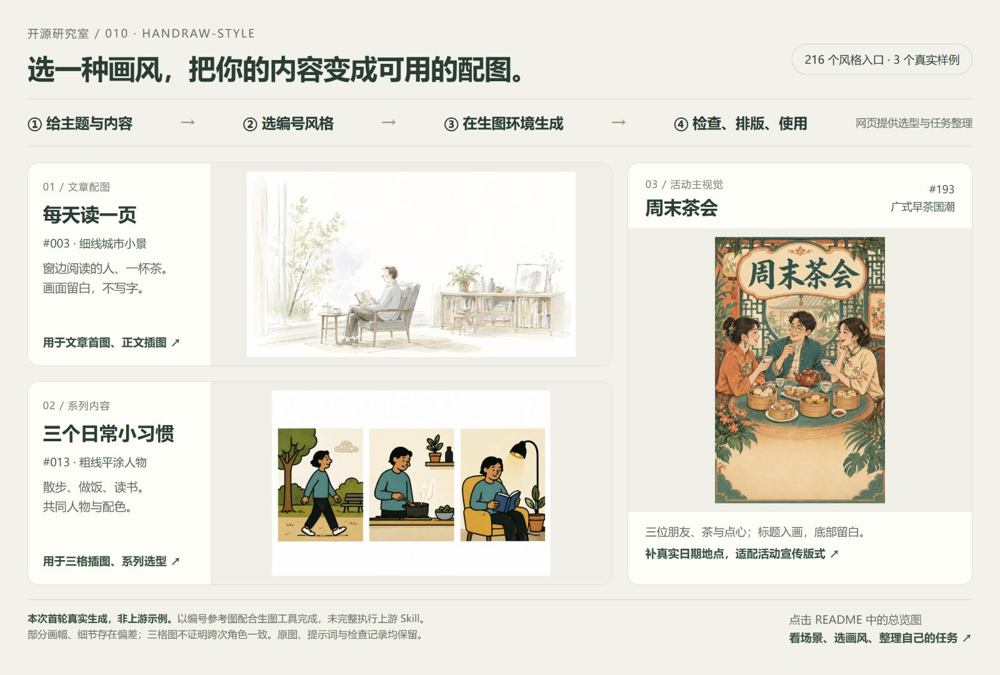
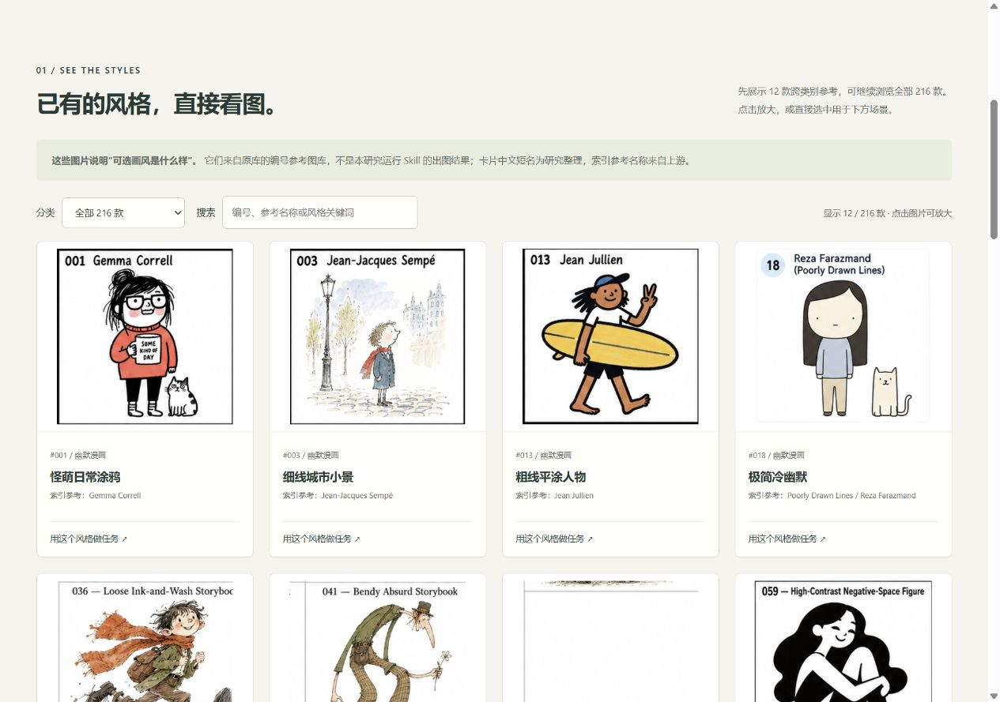
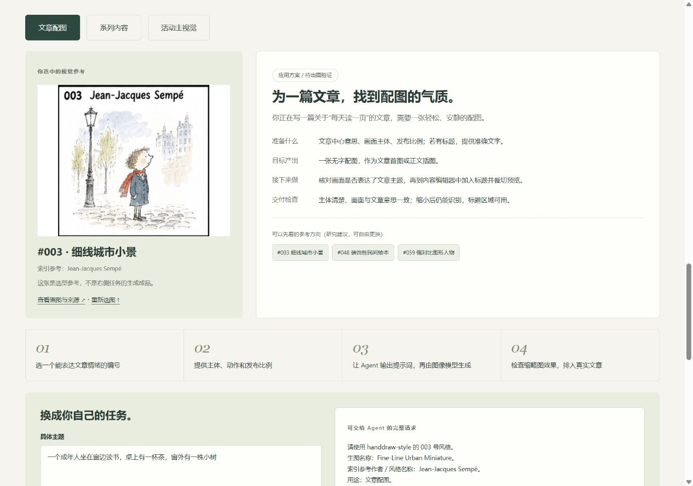

# 010 · handraw-style 视觉风格目录与提示词研究

> 给主题和内容，选一个画风，再交给生图工具：用文章配图、习惯三格和茶会主视觉三个真实样例，理解 216 款风格目录如何用于创作。

[返回总索引](../../README.md#项目索引) · [上游项目](https://github.com/yang0/handraw-style) · [源码与验证笔记](./notes/README.md) · [对照实验方案](./notes/experiment-plan.md)

**先看效果，再带入自己的任务。** 总览中的图片是本次实际生成的首轮结果。下面可打开三份原图、查看输入与偏差；交互网页还提供风格图库与主题／内容编辑器。

## 研究结论

**它的核心能力是扩展视觉风格的选择与表达。** 用户从编号画廊选择画风，给出主题，由 Skill 组织提示词；明确要求生图时，根据预设能力表选择文字描述或对应参考图。

如果“信息风格扩展”指让同一条信息用不同画风呈现，这个理解基本成立。更准确的名称是“视觉表达风格扩展”：它没有新增事实、知识检索或信息组织能力，也不负责把内容自动变成信息图、完整海报或视频。

例如，同一个“从每天读一页书开始”的主题，可以探索不同手绘方向；论点、文案与信息层级仍需创作者或其他工作流确定。

本轮完成源码整理、交互网页，并通过内置 image_gen 生成三个场景实例。**实际传入了对应编号参考图，未安装或完整执行上游 Skill。** 三张首轮图与提示词保留，不推断全库成功率；严格画幅、跨次角色一致性与最终发布仍需补充验证。

## 三个真实使用样例

三个场景分别对应文章发布、系列选型和活动宣传。点击表中的 PNG 查看完整结果；提示词和检查记录与原图一同保存。

| 场景 | 选用风格 | 实际输出 | 如何使用 |
| --- | --- | --- | --- |
| 读书文章配图 | 003 细线城市小景 | [窗边阅读 PNG](./assets/generated/article-reading-v1.png) | 放入文章，留白可排标题 |
| 日常习惯系列草案 | 013 粗线平涂人物 | [散步／做饭／读书三格 PNG](./assets/generated/habits-triptych-v1.png) | 作为系列选型或文章插图；这是同一图内三格 |
| 茶会活动主视觉 | 193 广式早茶国潮 | [周末茶会 PNG](./assets/generated/weekend-tea-v1.png) | 补真实日期地点，适配版式后使用 |

三张均为首次输出，未后期加工。三格图与茶会图的比例未符合要求；阅读图的树位置偏向窗边盆栽。完整记录见[生成与检查](./assets/generated/REVIEW.md)，实际指令见[提示词 JSON](./assets/generated/prompts.json)。

## 用自己的主题和内容，怎样做？

1. **准备需求**：一句主题、一段要表达的内容，以及用途、画幅和必须出现的准确文字。例如“每天读一页；成年人在窗边读书，有茶和植物；文章横版配图，不写字”。
2. **看图选风格**：在网页图库中选择编号，将风格带入文章、系列或活动任务。编号只在这个库内有意义，完整请求会附上风格资料和参考图来源。
3. **复制完整任务**：编辑主题、内容、画幅和要求，复制到具备生图工具的 Agent；按需加载上游 Skill 或读取编号资料、传入参考图，再实际生成。
4. **检查后使用**：核对内容、文字、比例与主体，再加入文章或补活动日期地点。系列内容还需另外验证多次生成的一致性。

**当前网页不直接调用生图服务，也不会随输入变化实时出图。** 它负责“看图选型＋整理生成任务”；库负责组织风格表达，图像模型负责生成，创作者负责核对和最终排版。三个样例已经实测出图，但不代表任意内容或全部 216 款风格均已验证。

## 交互研究网页

网页先展示三个实际样例，再提供上游已有的风格参考图：默认 12 款跨类别样图，可按七类筛选、搜索编号或参考名称、继续浏览全部 216 款，并点击放大。图片和索引按需从固定版本上游加载，未下载重新打包整套图库。

**看图选型 → 选择文章配图／系列内容／活动主视觉 → 修改主题、画幅和要求 → 复制完整任务 → 在生图环境执行 → 检查并完成排版。** 三类场景分别说明准备什么、目标产出、后续制作和交付检查，并提供可切换的参考方向。

图库参考图是上游内容；新增“实际样例”区展示本次生成的三张场景图，二者分别标注。下方任务编辑器供调整需求，不会随参数实时重画。原有能力、决策逻辑和项目比较保留在折叠区。

启动后可打开[本地研究网页](http://127.0.0.1:4319/projects/010-handraw-style/)。该地址只在本机预览服务运行时有效，尚未部署验证。构建、运行与检查方法见 [Web 说明](./web/README.md)，交互验证见[网页验证记录](./notes/web-verification.md)。

## 研究版本

| 项目 | 记录 |
| --- | --- |
| 上游 | yang0/handraw-style |
| 固定 commit | [e51f4f8b9edfd8d2f83e18a4a8eecc6dd5db51a7](https://github.com/yang0/handraw-style/tree/e51f4f8b9edfd8d2f83e18a4a8eecc6dd5db51a7) |
| 上游提交时间 | 2026-09-05T23:10:25Z |
| 研究日期 | 2026-09-06 |
| 实现组成 | Markdown Skill 与风格表、JSON 索引与能力配置、HTML 画廊、Python 辅助脚本 |
| 本地核对环境 | Windows / PowerShell；Node.js 22.15.0 用于研究仓库索引校验 |
| 许可记录 | 固定版本文件树未发现 LICENSE 文件；本项目只保存原创研究与来源链接 |

## 已有能力及边界

| 能力 | 上游提供什么 | 应怎样理解 |
| --- | --- | --- |
| 风格选择 | 001–216 编号、七类风格、拼图画廊和单张参考图 | 降低选型与沟通门槛；216 是目录条目数 |
| 风格资料 | 参考名称、生图名称、核心视觉特征 | 16 个条目的特征为空，详尽程度不同 |
| 提示词组织 | 编号＋主题，可补画幅、主体限制与文字要求 | 默认输出中英文提示词，不自动生成图片 |
| 轻量约束 | 默认不额外补构图、质量形容词或负面要求 | 留出模型发挥空间，具体交付规格需另加 |
| 参考图决策 | 名称、名称加特征、参考单图三条路径 | 由预设配置决定，不是运行时自动检测理解能力 |
| 资料维护 | 索引与画廊生成、拼图切分、资料校验脚本 | 检查文件和规则一致性，不测量图像质量 |
| 实际绘图 | Skill 指导宿主调用外部生图工具 | 没有独立图像模型、训练权重或通用生图服务 |

来源：[固定版本 Skill](https://github.com/yang0/handraw-style/blob/e51f4f8b9edfd8d2f83e18a4a8eecc6dd5db51a7/handdraw-style-prompter/SKILL.md)、[风格索引](https://github.com/yang0/handraw-style/blob/e51f4f8b9edfd8d2f83e18a4a8eecc6dd5db51a7/handdraw-style-prompter/references/styles.json)。

## 从主题到提示词

1. 用户浏览画廊，选择编号，并明确要表现的主题。
2. Agent 查找编号对应的名称与资料，组织用户提供的约束。
3. 普通请求交付中英文提示词；默认不额外扩写视觉特征或补文案。
4. 明确要求生图时查能力表：名称标记为强时只用名称；否则视配置与特征是否可用选择补特征或传参考图。
5. 传图时要求仅借鉴视觉语言，内容以用户文字为准；这一要求仍依赖模型执行。

实际源码有两个需要适配的细节：参考图与画廊使用作者的固定本地路径；命令行提示词脚本的英文段落直接复用输入主题，不自动翻译中文。对话模式的自然双语表达由 Agent 完成。

## 与已有研究的区别

| 项目 | 主要问题 | 能力重点 |
| --- | --- | --- |
| handraw-style | 想选哪种画风，怎样描述？ | 编号图鉴、风格资料、提示词和参考图策略 |
| [003 · wibi-style](../003-wibi-style/README.md) | 如何把照片或想法做成特定效果？ | 28 套风格制作配方，含输入处理、构图和检查要求 |
| [004 · mono-color](../004-mono-color-skill/README.md) | 如何统一配色、构图和文字？ | 受控色彩、版式、字体与印刷质感规则 |
| [005 · XXD Panel 092](../005-xxd-panel-092/README.md) | 如何将照片转成线描，并组织制作任务？ | 钢笔表现、输出模式与交付流程；研究另探讨注释、观察和连续叙事扩展 |
| [008 · 白板视频](../008-whiteboard-book-video-skill/README.md) | 如何把观点讲成视频？ | 口播、分镜、配图、字幕与渲染 |

216 个目录条目不能直接与 28 套制作流程比较能力强弱。各库规则也不能直接叠加：某个风格的色彩与 mono-color 的限色要求可能冲突；白板视频更换画风后，需要重新验证分镜可读性和系列一致性。

005 已区分“更换视觉风格”和“增加注释、结构、叙事等信息表达能力”。handraw-style 主要扩展前者；要做观察页、结构说明或连续故事，仍需额外的信息依据和制作规范。

## 对我们的价值与投入判断

- **可借鉴的入口**：以真实图鉴帮助用户选择，再通过编号和名称复用视觉方向。
- **可借鉴的资料结构**：分开维护参考来源、风格名称、可观察特征，方便检索与后续评测。
- **值得验证的问题**：只给名称、补充特征和传参考图，哪一种更能保留画风并服从新主题？

本项目采用轻量研究与能力说明页，帮助理解选择与表达的方法。我们已经在 wibi-style 与 mono-color 中研究过规则驱动生成；下一步优先针对真实配图需求做小规模对照，而非仅追求更多风格数量。

编号可帮助追溯选择，但不保证同一人物、同一笔触或跨模型一致性。能力表未提供可核验的逐风格生成成绩；本研究不对还原率、成功率、耗时或费用作结论。

## 资料与验证入口

- [源码与验证笔记](./notes/README.md)：固定来源、目录核对、实现细节和验证边界。
- [对照实验方案](./notes/experiment-plan.md)：固定主题，比较三种表达方式；尚未执行。
- [素材说明](./assets/README.md)：真实网页截图与原创流程示意的来源。
- [Web 说明](./web/README.md)：本地构建、预览与交互范围。
- [网页验证记录](./notes/web-verification.md)：布局、路径切换、复制与静态资源检查。

维护索引时，在仓库根目录运行 `node scripts/projects.mjs sync` 和 `node scripts/projects.mjs check`。本子项目无新增运行依赖。
